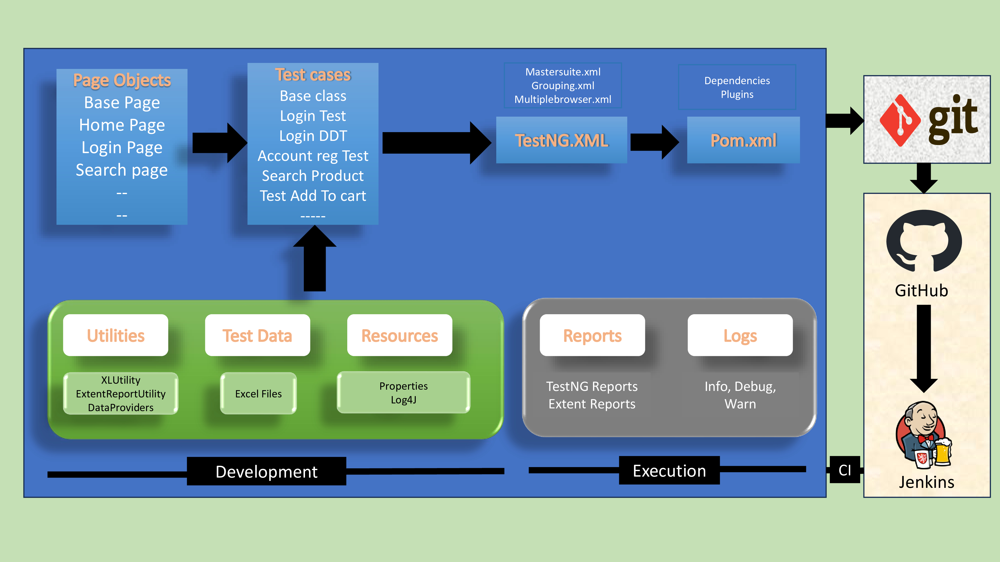

Selenium Project
## Framework Design

## Devlopment of Hybrid Driven framework.

1) Test case: Account Registration
   1. Create <u>**BasePage**</u> under **"pageObjects"** which includes only constructor. This will be invoked by every Page Object Class constructor (Re-usability).
   2. Create page object classes for <u>**HomePage, RegistrationPage**</u> under **pageObjects** package.(These classes extends from BasePage).
   3. Create <u>**AccountRegistrationTest**</u> under **"testCases"**
   4. Create <u>**BaseClass**</u> under **testBase** package and copy re-usable methods.
   5. Create re-usable methods to generate random numbers and strings in <u>**BaseClass**</u>

### Choosing test cases for automation 

1. **sanity test cases** - **P1**
2. **data driven test cases/re-tests** - **P2**
3. **Regression test cases** - **P3**
4. **Any other test cases** - **P4**

