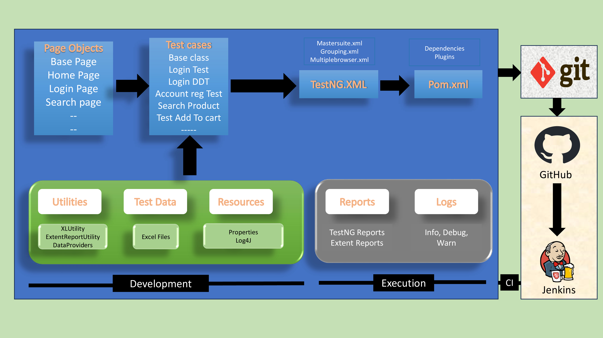

Selenium Project
## Framework Design

### Choosing test cases for automation 

1. **sanity test cases** - **P1**
2. **data driven test cases/re-tests** - **P2**
3. **Regression test cases** - **P3**
4. **Any other test cases** - **P4**
